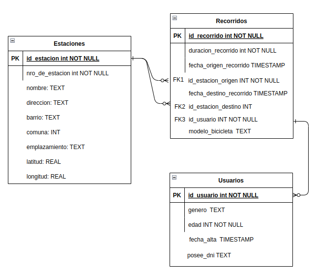
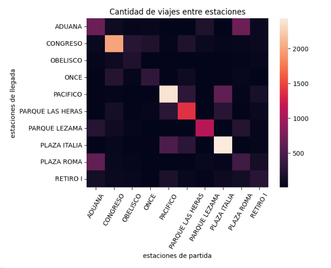

# fudo_challenge

## Como ejecutar el programa

Se decidio implementar la solucion en un Notebook ejecutado en Google Colab `FUDO_challenge.ipynb`. Simulando la lectura de los datos desde otro sistema (un Google Drive personal). Para poder ejecutar los pasos, lo unico que hay que modificar es reemplazar el path a los archivos, por el path donde decidan colocar los archivos (en google Drive). Tambien hay que darle permiso al notebook de los archivos de Google Drive, ejecutando la primer celda. Al finalizar el Notebook se generara una DB en `sqlite3` llamado `ciclistas.db`.

## Hipotesis

Para resolver el ejercicio presente se tomaron las siguientes hipotesis:

1) Dado que el set de datos esta en espaniol, y pertenece al gobierno de la Ciudad de Buenos Aires. Se decidio respetar el uso de espaniol en el codigo y en el set de datos. Estandarizando nombres y campos en el mismo idioma.

2) En el dataset de estaciones de bici, existen 2 campos que permiten univocamente indentificar un registro del mismo dataset: "ID Comet" y "NUMERO de Estacion". Se decidio optar por usar "ID Comet" como ID del dataset, ya que es facilita el preprocesamiento del dataset de Recorridos. Para poder referenciar el "numero de estacion", habria que obtener el dato de "nombre_estacion_origen" eliminando la parte del nombre en si (ademas que es menos claro obtener el id de un campo llamado "nombre_estacion" cuando ya existe un campo llamado "id_estacion").

3) Todos los campos originales de los dataset es preservada, salvo los campos que son deducibles de otras tablas.

4) Los atributos de los datasets fueron estandarizados a `snake_case`. Por lo que campos como "NUMERO de Estacion" se cambia por "nro_de_estacion".

5) Respecto a valores faltantes (o missing values), lo unico destacable detectado fueron los datos faltantes de 2 registros de recorridos donde no se registro la estacion de destino (y por ende la devolucion de la bicicleta). Estos registros se guardaron teniendo en cuenta que hay que considerarlos a la hora de hacer ciertas consultas.

## Modelo de Base de datos

La solucion propuesta es una del modelo estrella de Kimball. Donde la tabla "Recorridos" es la tabla de hechos y las tablas de "estaciones" y "usuarios" son tablas de dimension.

## Visualizacion de datos

A continuacion se presenta un grafico de distintas estaciones del centro de BsAs y su caudal de viajes entre ellas (1):

Algo que se puede apreciar es que los viajes donde se vuelve al origen en ciertas estaciones es algo bastante frecuente. Se podria presuponer que muchos usuarios usan las bicis para pasear o hacer ejercicio, siendo mucho menos comunes los viajes en si dado que son lugares con demasiada circulacion de autos para trasladarse en bicicleta.

(1) NOTA: Trate de levantar la DB en Metabase on premise, pero tuve demasiados problemas y poco tiempo para conectar metabase a la DB. Por lo que a fin de completar el ejercicio, la visualizacion fue hecha en Python.

Otras visualizaciones interesantes que hubiera hecho con tiempo:

- Como varia el flujo de viajes del top 5 de estaciones a lo largo de los meses.
- Flujo de viajes en cada estacion en un mapa
- 

## Puntos extra

### Utilizar técnicas de optimización de consultas SQL para mejorar el rendimiento delsistema.

Se hizo un analisis del costo de las queries solicitadas por enunciado (2), sin agregar indices secundarios. Y estos fueron los resultados:

#### Relación entre la duración de los viajes y el modelo de bicicleta.

`[(6, 0, 0, 'SCAN recorridos'), (8, 0, 0, 'USE TEMP B-TREE FOR GROUP BY')]`

#### Relación entre la edad de los usuarios y la cantidad de viajes que realizaron.

`[(9, 0, 0, 'SCAN re'), (14, 0, 0, 'SEARCH us USING INTEGER PRIMARY KEY (rowid=?)'), (17, 0, 0, 'USE TEMP B-TREE FOR GROUP BY')]`

#### Relación entre la cantidad de viajes realizados y la fecha de alta de los usuarios.

`[(8, 0, 0, 'SCAN re'), (10, 0, 0, 'SEARCH us USING INTEGER PRIMARY KEY (rowid=?)'), (13, 0, 0, 'USE TEMP B-TREE FOR GROUP BY')]`

#### Comunas que más viajes reciben

`[(8, 0, 0, 'SCAN re'), (10, 0, 0, 'SEARCH est USING INTEGER PRIMARY KEY (rowid=?)'), (13, 0, 0, 'USE TEMP B-TREE FOR GROUP BY'), (50, 0, 0, 'USE TEMP B-TREE FOR ORDER BY')]`

#### Comunas de las que más viajes parten

`[(8, 0, 0, 'SCAN re'), (12, 0, 0, 'SEARCH est USING INTEGER PRIMARY KEY (rowid=?)'), (15, 0, 0, 'USE TEMP B-TREE FOR GROUP BY'), (52, 0, 0, 'USE TEMP B-TREE FOR ORDER BY')]`

#### Usuarios más activos durante 2023.

`[(8, 0, 0, 'SCAN recorridos'), (10, 0, 0, 'USE TEMP B-TREE FOR GROUP BY'), (51, 0, 0, 'USE TEMP B-TREE FOR ORDER BY')]`

(2) NOTA: El analisis se hizo usando la funcion `EXPLAIN QUERY PLAN`. 

#### Indice probados

Se probo agregar los siguientes indices sin lograr ninguna mejora:

- indice secundario por id_estacion_origen en la tabla de recorridos
- indice secundario por id_estacion_destino en la tabla de recorridos
- indice secundario por comunas en la tabla de estaciones

Sin embargo si se logro una mejora al usar id_usuario de la tabla recorridos como indice secundario. Mejorando la performance de la query de usuarios mas activos de 2023:

`[(8, 0, 0, 'SCAN recorridos USING COVERING INDEX idx_id_usuario'), (43, 0, 0, 'USE TEMP B-TREE FOR ORDER BY')]`

Como se puede apreciar se realizaron menos operaciones para resolver la query. Esto no afecto la performance de las demas queries. Por otro lado, si bien opte por usar este indice, hay que tener en cuenta que el uso de demasiados indices, mejora la lectura pero vuelve mas lenta la lectura de la DB. Que es algo que note probando dichos indices.

### Utilizar herramientas de análisis de big data para analizar conjuntos de datos más grandes

Si bien por el volumen de datos se decidio usar Pandas. Es verdad que en primer lugar, Pandas se ejecuta en una sola computadora y mas aun, levanta todo en memoria y contiguo. Por lo que se desarollo una solucion en PySpark (en `FUDO_ejercicio_spark.ipynb`), un framework distribuido para manejar un mayor volumen de datos. (2)

(2) NOTA: Por falta de tiempo esta solucion fue implementada a medias. Pero la implementacion es equivalente a la hecha en pandas.