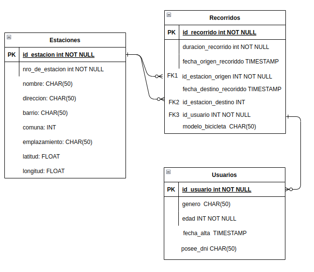

# fudo_challenge

## Como ejecutar el programa

Se decidio implementar la solucion en un Notebook ejecutado en Google Colab. Simulando la lectura de los datos desde otro sistema (un Google Drive personal). Para poder ejecutar los pasos, lo unico que hay que modificar es reemplazar el path a los archivos, por el path donde decidan colocar los archivos (en google Drive).

## Hipotesis

Para resolver el ejercicio presente se tomaron las siguientes hipotesis:

1) Dado que el set de datos esta en espaniol, y pertenece al gobierno de la Ciudad de Buenos Aires. Se decidio respetar el uso de espaniol en el codigo y en el set de datos. Estandarizando nombres y campos en el mismo idioma.

2) En el dataset de estaciones de bici, existen 2 campos que permiten univocamente indentificar un registro del mismo dataset: "ID Comet" y "NUMERO de Estacion". Se decidio optar por usar "ID Comet" como ID del dataset, ya que es facilita el preprocesamiento del dataset de Recorridos. Para poder referenciar el "numero de estacion", habria que obtener el dato de "nombre_estacion_origen" eliminando la parte del nombre en si (ademas que es menos claro obtener el id de un campo llamado "nombre_estacion" cuando ya existe un campo llamado "id_estacion").

3) Todos los campos originales de los dataset es preservada, salvo los campos que son deducibles de otras tablas.

4) Los atributos de los datasets fueron estandarizados a `snake_case`. Por lo que campos como "NUMERO de Estacion" se cambia por "nro_de_estacion".

5) Respecto a valores faltantes (o missing values), lo unico destacable detectado fueron los datos faltantes de 2 registros de recorridos donde no se registro la estacion de destino (y por ende la devolucion de la bicicleta). Estos registros se guardaron teniendo en cuenta que hay que considerarlos a la hora de hacer ciertas consultas.

## Modelo de Base de datos

La solucion propuesta es una del modelo estrella de Kimball. Donde la tabla "Recorridos" es la tabla de hechos y las tablas de "estaciones" y "usuarios" son tablas de dimension.

